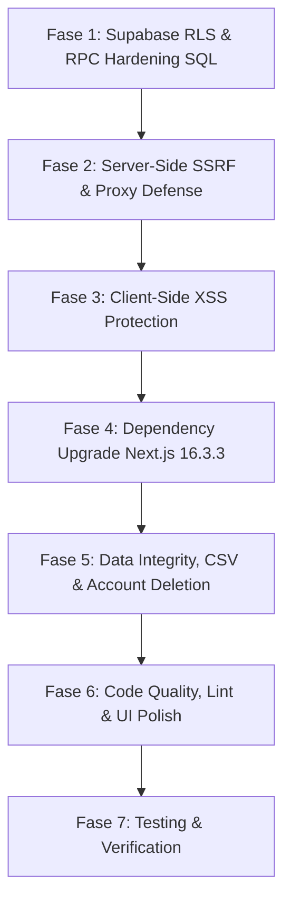

# Master Plan Remediasi Keamanan & Refactoring: Creatorlytics (Next.js 16 + Supabase)

Dokumen ini merupakan panduan dan rencana aksi terstruktur berdasarkan security audit menyeluruh terhadap arsitektur Next.js 16, Supabase RLS, API routes, dan komponen frontend Creatorlytics.

---

## 1. Penilaian Audit & Matriks Risiko

### Opini & Evaluasi
Hasil audit yang disampaikan **sangat valid, komprehensif, dan memiliki tingkat keparahan tinggi (P0/Critical)**. Pada arsitektur di mana client melakukan direct CRUD ke database Supabase, **Row Level Security (RLS)** dan sanitasi input/URL di server adalah satu-satunya perimeter pertahanan. Celah pada RLS, SSRF di thumbnail routes, dan XSS via `javascript:` URI dapat mengakibatkan full user directory dump, privilege escalation antar-workspace, serta account takeover.

### Matriks Klasifikasi Temuan

| Prioritas | Temuan / Area | Akar Masalah | Dampak Potensial |
|---|---|---|---|
| **P0 (Kritis)** | **RLS Directory Dump (`profiles_public_select`)** | Policy `profiles` anon select berstatus `qual: true` | Siapapun tanpa autentikasi bisa dump seluruh email, display name, avatar, dan prefs user via REST API Supabase. |
| **P0 (Kritis)** | **Privilege Escalation via Invite Claim** | Policy UPDATE pada `planner_collaborators` tidak membatasi `role` / `owner_id` | Attacker bisa mengubah `owner_id` ke workspace target dan memberi dirinya role `editor`. |
| **P0 (Kritis)** | **Public Share Token Harvesting** | Policy `planner_shares` `public_enabled = true` tanpa filter token spesifik | Attacker bisa membaca semua token & `owner_id` publik sekaligus. |
| **P0 (Kritis)** | **SSRF & Open Proxy** (`/api/thumbnail`, `/proxy`) | Server mem-`fetch` URL eksternal mentah tanpa filter IP private / cloud metadata (`169.254.169.254`) | Potensi exfiltration IAM credentials & relay XSS via arbitary Content-Type. |
| **P0 (Kritis)** | **Stored/DOM XSS via `javascript:` URI** | `link.ts`, `BriefModal`, `GuestBriefModal`, `planner/page.tsx` tidak memvalidasi skema protokol URL | Editor collaborator bisa menyuntikkan script berbahaya di link post/idea untuk mencuri session workspace owner. |
| **P0 (Kritis)** | **Next.js Framework CVEs** | `next@16.2.6` memiliki high severity security advisories | SSRF pada Server Actions & Server Functions disclosure. Target upgrade: `16.3.3`. |
| **P1 (Sedang)** | **CSV Formula Injection** | `lib/utils/export.ts` tidak menyaring karakter formula (`=`, `+`, `-`, `@`) | Eksekusi formula berbahaya saat file CSV dibuka di Microsoft Excel / Google Sheets. |
| **P1 (Sedang)** | **Incomplete Account Deletion** | `app/settings/page.tsx` hanya menghapus data tabel tapi tidak menghapus user di `auth.users` | User masih terdaftar di Supabase Auth; butuh endpoint admin delete server-side. |
| **P1 (Sedang)** | **React 19 / Compiler Lint Errors (18 error, 14 warning)** | Hoisting variable `setCurrentPage` dan `setState` tanpa guard di dalam `useEffect` | Kegagalan optimasi React Compiler & potensi cascading re-renders. |
| **P2 (Rendah)** | **Debug Logs & UI Dialog Polish** | Sisa `console.log` di `CollaborationContext.tsx` & penggunaan `confirm()` bawaan browser | Logging berlebih di console client & pengalaman UX yang kurang aman saat aksi destruktif. |

---

## 2. Rencana Eksekusi Bertahap



---

## FASE 1: Database & RLS Policy Hardening (Supabase SQL)

> Eksekusi script SQL berikut di **Supabase Dashboard → SQL Editor**:

```sql
-- ============================================================================
-- 1.1 Hardening Policy Tabel PROFILES (Tutup User Directory / Email Dump)
-- ============================================================================
DROP POLICY IF EXISTS profiles_public_select ON public.profiles;

CREATE POLICY profiles_public_select ON public.profiles
FOR SELECT TO anon
USING (
  EXISTS (
    SELECT 1 FROM public.planner_shares
    WHERE planner_shares.owner_id = profiles.id
      AND planner_shares.public_enabled = true
  )
);

-- Batasi kolom yang dapat dibaca anon (Column-Level Security)
REVOKE SELECT ON public.profiles FROM anon;
GRANT SELECT (id, display_name, avatar_url) ON public.profiles TO anon;


-- ============================================================================
-- 1.2 Hapus Policy Berbahaya pada PLANNER_COLLABORATORS (Privilege Escalation)
-- ============================================================================
DROP POLICY IF EXISTS "Collaborator claims own invite" ON public.planner_collaborators;


-- ============================================================================
-- 1.3 Hardening PLANNER_SHARES & RPC get_share_by_token
-- ============================================================================
DROP POLICY IF EXISTS "Public read by token" ON public.planner_shares;

CREATE OR REPLACE FUNCTION public.get_share_by_token(p_token text)
RETURNS SETOF public.planner_shares
LANGUAGE sql SECURITY DEFINER SET search_path = public
AS $$
  SELECT * FROM public.planner_shares
  WHERE share_token = p_token
    AND (
      public_enabled = true
      OR owner_id = auth.uid()
      OR EXISTS (
        SELECT 1 FROM public.planner_collaborators pc
        WHERE pc.owner_id = planner_shares.owner_id 
          AND pc.collaborator_user_id = auth.uid() 
          AND pc.status = 'active'
      )
      OR EXISTS (
        SELECT 1 FROM public.planner_share_members psm
        WHERE psm.share_id = planner_shares.id 
          AND psm.collaborator_user_id = auth.uid()
      )
    );
$$;


-- ============================================================================
-- 1.4 Hardening RPC claim_workspace_share & get_users_info
-- ============================================================================
CREATE OR REPLACE FUNCTION public.claim_workspace_share(p_share_token text)
RETURNS jsonb
LANGUAGE plpgsql SECURITY DEFINER SET search_path = public
AS $$
DECLARE
  v_user_id uuid := auth.uid();
  v_user_email text := auth.jwt()->>'email';
  v_share public.planner_shares%ROWTYPE;
BEGIN
  IF v_user_id IS NULL THEN
    RAISE EXCEPTION 'Not authenticated';
  END IF;

  SELECT * INTO v_share FROM public.planner_shares 
  WHERE share_token = p_share_token AND public_enabled = true;
  
  IF NOT FOUND THEN
    RAISE EXCEPTION 'Invalid or disabled share link';
  END IF;

  INSERT INTO public.planner_share_members (share_id, collaborator_user_id, collaborator_email)
  VALUES (v_share.id, v_user_id, v_user_email)
  ON CONFLICT (share_id, collaborator_user_id) DO NOTHING;

  RETURN jsonb_build_object('success', true, 'share_id', v_share.id, 'owner_id', v_share.owner_id);
END;
$$;

CREATE OR REPLACE FUNCTION public.get_users_info(p_user_ids uuid[])
RETURNS TABLE(id uuid, email text, display_name text, avatar_url text)
LANGUAGE sql SECURITY DEFINER SET search_path = public
AS $$
  SELECT p.id, p.email, p.display_name, p.avatar_url
  FROM public.profiles p
  WHERE p.id = ANY(p_user_ids)
    AND (
      p.id = auth.uid()
      OR EXISTS (
        SELECT 1 FROM public.planner_collaborators pc
        WHERE (pc.owner_id = auth.uid() AND pc.collaborator_user_id = p.id)
           OR (pc.owner_id = p.id AND pc.collaborator_user_id = auth.uid())
      )
      OR EXISTS (
        SELECT 1 FROM public.planner_share_members psm
        JOIN public.planner_shares ps ON ps.id = psm.share_id
        WHERE (ps.owner_id = auth.uid() AND psm.collaborator_user_id = p.id)
           OR (ps.owner_id = p.id AND psm.collaborator_user_id = auth.uid())
      )
    );
$$;


-- ============================================================================
-- 1.5 Query Verifikasi Definisi Fungsi Kolaborator
-- ============================================================================
-- Jalankan untuk memeriksa apakah role 'editor' sudah dicek secara ketat:
SELECT proname, prosecdef, pg_get_functiondef(oid) as definition
FROM pg_proc
WHERE proname IN ('is_editor_collaborator', 'is_active_collaborator');
```

---

## FASE 2: Server-Side SSRF Defense & Proxy Hardening

### 2.1 Buat Helper `lib/utils/url-guard.ts`
- Validasi skema URL (`http:`, `https:`).
- Blokir IP privat: `10.0.0.0/8`, `172.16.0.0/12`, `192.168.0.0/16`, `127.0.0.0/8`, serta link-local / Cloud Metadata `169.254.169.254`.
- Pre-resolve hostname via `dns.lookup` untuk mencegah target internal.

### 2.2 Refactor `app/api/thumbnail/route.ts`
- Tambahkan session auth check (`supabase.auth.getUser()`).
- Panggil `await assertSafeExternalUrl(url)` sebelum handler TikTok, Instagram, YouTube, dan generic OG.
- Pasang `signal: AbortSignal.timeout(5000)` di setiap `fetch` call.

### 2.3 Refactor `app/api/thumbnail/proxy/route.ts`
- Cek session auth user.
- Terapkan `assertSafeExternalUrl(url)`.
- Validasi header `Content-Type` harus `image/*` (tolak `text/html` dengan status `415`).
- Batasi buffer size (maksimal 8MB).
- Hapus header wildcard `Access-Control-Allow-Origin: '*'`.

### 2.4 Update `app/api/collab/guest/route.ts`
- Ganti pemanggilan langsung `.from('planner_shares').eq('share_token', token)` menjadi RPC call `.rpc('get_share_by_token', { p_token: token })`.

---

## FASE 3: Client-Side XSS Protection & Canonical Sanitization

### 3.1 Perbarui `lib/utils/link.ts`
- Buat fungsi kanonikal `getValidHref`:
  - Izinkan hanya skema `http:` dan `https:`.
  - Parse embed TikTok, Instagram, YouTube secara aman.
  - Kembalikan `'#'` jika link berupa `javascript:`, data URI, atau skema tak dikenal.

### 3.2 Pasang Sanitizer & Hapus Duplikasi
- `app/content/page.tsx`: Hapus fungsi lokal, import dari `@/lib/utils/link`.
- `app/share/content/[token]/page.tsx`: Hapus fungsi lokal, import dari `@/lib/utils/link`.
- `components/planner/BriefModal.tsx`: Gunakan `href={getValidHref(link)}` untuk render `ref_links`.
- `components/planner/GuestBriefModal.tsx`: Gunakan `href={getValidHref(link)}`.
- `app/planner/page.tsx`: Gunakan `href={getValidHref(link)}`.

---

## FASE 4: Framework & Dependency Security Updates

1. Eksekusi update versi:
   ```bash
   npm install next@16.3.3 eslint-config-next@16.3.3
   ```
2. Validasi audit:
   ```bash
   npm audit
   ```
3. Pastikan `tsc --noEmit` tetap lulus tanpa error.

---

## FASE 5: Data Integrity, Export Security & Account Deletion

### 5.1 Sanitize CSV Export di `lib/utils/export.ts`
- Tambahkan proteksi karakter formula Excel (`=`, `+`, `-`, `@`, `\t`, `\r`):
  ```typescript
  function sanitizeCsvCell(val: string): string {
    return /^[=+\-@\t\r]/.test(val) ? `'${val}` : val;
  }
  ```

### 5.2 Server Route Delete Account `app/api/account/delete/route.ts`
- Gunakan Supabase Admin Client (`SUPABASE_SERVICE_ROLE_KEY` di server).
- Panggil `admin.auth.admin.deleteUser(user.id)`.

### 5.3 Hubungkan UI Settings di `app/settings/page.tsx`
- Update `handleDeleteAccount` untuk memanggil `factoryReset()` lalu `POST /api/account/delete`.
- Ganti `window.confirm()` dengan `<ConfirmDialog>`.

---

## FASE 6: Code Quality, Lint Cleanup & Security Headers

### 6.1 Perbaikan React 19 Linting
- **`app/content/page.tsx`**: Pindahkan inisialisasi state `setCurrentPage` sebelum pemanggilannya.
- **Context & Modals**: Bungkus pemanggilan `setState` dalam `useEffect` dengan guard kondisi atau ref untuk mencegah infinite / cascading re-renders di:
  - `lib/context/DataContext.tsx`
  - `lib/context/CollaborationContext.tsx`
  - `lib/context/ThemeContext.tsx`
  - `components/planner/BriefModal.tsx`

### 6.2 Cleanup & Security Headers
- Hapus `console.log` di `lib/context/CollaborationContext.tsx`.
- Hapus dead code `getThumbnailFromLink` di `lib/utils/thumbnail.ts`.
- Tambahkan header keamanan di `next.config.ts`:
  ```typescript
  // next.config.ts
  const nextConfig = {
    async headers() {
      return [
        {
          source: '/(.*)',
          headers: [
            { key: 'X-Frame-Options', value: 'DENY' },
            { key: 'X-Content-Type-Options', value: 'nosniff' },
            { key: 'Referrer-Policy', value: 'strict-origin-when-cross-origin' },
          ],
        },
      ];
    },
  };
  export default nextConfig;
  ```

---

## FASE 7: Verifikasi & Testing

1. **Typecheck & Linting**:
   ```bash
   npx tsc --noEmit
   npm run lint
   ```
2. **SSRF Guard Test**:
   - Hit `/api/thumbnail?url=http://169.254.169.254/latest/meta-data` -> pastikan mendapat `400 URL not allowed`.
3. **XSS Sanitization Test**:
   - Masukkan link `javascript:alert(document.cookie)` -> pastikan href menjadi `#` dan tidak ada payload yang tereksekusi.
4. **CSV Injection Test**:
   - Export post dengan judul `=SUM(A1:A10)` -> pastikan sel berawalan tanda petik `'=SUM...`.
5. **RLS Verification**:
   - Test REST endpoint `profiles` via anon key -> verifikasi bahwa user directory tidak bisa di-dump tanpa public share.
